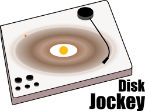

DiskJockey
===============

Copyright Ian Czekala and collaborators 2014-16

email: iancze@gmail.com

This package derives dynamical masses for T Tauri stars using the Keplerian motion of their circumstellar disks, applied to radio interferometric data from the Atacama Large Millimeter Array (ALMA) and the Submillimeter Array (SMA). **If you use this code or a derivative of it in your research, you must cite [Czekala et al. 2015 ApJ, 806 154C](http://adsabs.harvard.edu/abs/2015ApJ...806..154C).**

See an explanation of [how dynamical mass measurements](http://iancze.github.io/dynamical/) work.

Papers published using DiskJockey:

* *A Disk-based Dynamical Constraint on the Mass of the Young Binary AK Sco*: [Czekala et al. 2015 ApJ, 806 154C](http://adsabs.harvard.edu/abs/2015ApJ...806..154C)
* *A Disk-based Dynamical Constraint on the Mass of the Young Binary DQ Tau* : [Czekala et al. 2016 ApJ, 818 156C](http://adsabs.harvard.edu/abs/2016ApJ...818..156C)

We can also be found in the [astrophysics source code library](http://ascl.net/1603.011) as well.

# Organization

DiskJockey is designed to forward model interferometric observations of protoplanetary disks, for the purpose of deriving a precise measurement of the central (sub-)stellar mass.

This package relies upon the excellent radiative synthesis package RADMC-3D to perform the radiative transfer of the disk model. Comprehensive documentation for RADMC-3D can be found [here](http://www.ita.uni-heidelberg.de/~dullemond/software/radmc-3d/). For package versions after v0.1.2, RADMC-3D is installed locally within the DiskJockey package. This means that you should be able to run all of the examples without needing to install RADMC-3D separately. If you already use RADMC-3D for other synthesis, this will leave your current installation alone, it's just that DiskJockey will use the version it installed for itself.

There are several stages to evaluating the best-fitting parameters of a disk structure model:

1. model specification
2. radiative synthesis
3. visibility interpolation
4. likelihood evaluation

I have organized the code in this package into source (in the `src` directory) and scripts (in the `scripts`) directory. After installation (see below), if you do

    using DiskJockey

You will be able to access any of the modules within `src`. These provide the base functionality for the package in common tasks, such as reading in images produced by RADMC-3D, Fourier transforms, and visibility interpolation. My hope is to make these components as general as possible so if you would like to extend this package to fit a novel type of disk, it will be easy to reuse many of the core functionality.

The scripts are not technically part of the Julia package (you cannot import them like the modules) but instead provide "driver scripts" that utilize the core modules to address a certain research question. For example, `DJ_initializ.jl` writes input files to disk, and `DJ_sythesize_model.jl` synthesizes a model using RADMC-3D. These are run from your system shell after adding them to your `PATH`

    $ DJ_initialize.jl && DJ_sythesize_model.jl

## Computational demand

Because spectral line datasets are large, and synthesizing models is computationally expensive, I have designed this package to work in a parallel environment. Therefore, please keep this architecture in mind when navigating the source code. Due to the computationally expensive nature of the radiative synthesis, fitting sizable datasets (e.g., SMA and ALMA) will **require a substantial amount of CPU cores to explore a posterior distribution in a reasonable timeframe**. For example, to fully explore the posterior for the AK Sco example dataset (to a density comparable to the plots in the ApJ paper) will require a **few days** of computing time on ~32 cores or more.

## Installation

### Julia

First, you should to install the [Julia programming language](https://github.com/Astrochem/UVHDF5) on your machine. Instructions can be found [here](http://julialang.org/downloads/). I have found it exciting to install from source via the [github repo](https://github.com/JuliaLang/julia/), but it may be a bit quicker to use a pre-compiled binary. If you've successfully installed everything, you should be able to open up a Julia interpreter and type

    $ julia
                   _
       _       _ _(_)_     |  A fresh approach to technical computing
      (_)     | (_) (_)    |  Documentation: http://docs.julialang.org
       _ _   _| |_  __ _   |  Type "?help" for help.
      | | | | | | |/ _` |  |
      | | |_| | | | (_| |  |  Version 0.4.2-pre+12 (2015-11-19 02:34 UTC)
     _/ |\__'_|_|_|\__'_|  |  Commit 9e598b6* (83 days old release-0.4)
    |__/                   |  x86_64-unknown-linux-gnu

    julia> println("Hello world")
    Hello world

Depending on how you choose to install Julia, you may need to take the additional step of adding the Julia executable to your `PATH`. [Here](https://en.wikibooks.org/wiki/Introducing_Julia/Getting_started#Running_directly_from_terminal) are some suggestions for OS X if you are experiencing difficulty.

### Fortran

Some of the packages that DiskJockey requires (e.g. [Dierckx.jl](https://en.wikibooks.org/wiki/Introducing_Julia/Getting_started#Running_directly_from_terminal)) require a Fortran compiler. On linux, try looking to make sure you have `gcc/gfortran` or something like it installed. For OS X, you can download these packages from [here](http://hpc.sourceforge.net/).

### DiskJockey

Next, we will install the `DiskJockey` package itself. Because this is not yet an official Julia package, for now, installation involves simply cloning the repository. First, open up a Julia prompt in the REPL, then type

    julia> Pkg.clone("https://github.com/iancze/DiskJockey.git")
    julia> Pkg.build("DiskJockey")

This process may take a few minutes as the relevant packages (including RADMC-3D) are downloaded from the web and installed. So far, I have only been able to extensively test this installation process on Linux machines. If you run into errors in this build process, please file an [issue](https://github.com/iancze/DiskJockey/issues) on the github repository so that we may try to fix this. If you already have RADMC-3D installed on your system, this process won't interfere with that installation, `DiskJockey` will use the version of RADMC-3D it downloaded.

As mentioned previously, there are several "driver" command line scripts that are used to perform the actual mass fitting. To complete the installation, you should add these files to your system PATH. To figure out where the package is installed

    julia> Pkg.dir("DiskJockey")
    "/home/ian/.julia/DiskJockey"

Your PATH will vary. The scripts are located inside of the `scripts` directory, so if you are using bash or Z-shell, you will want to add the PATH that looks something like

    export PATH="/home/ian/.julia/DiskJockey/scripts:$PATH"

inside of your `.bashrc` or `.zshrc` file.

Some of the Python scripts also depend on imports from this directory, so you will also need to add

    export PYTHONPATH="/home/ian/.julia/DiskJockey/scripts:$PYTHONPATH"

inside of your `.bashrc` or `.zshrc` file. Finally,

    $ source ~/.zshrc

To check that you have properly added the scripts (and check that you installed the correct version), you can try in your system shell

    $ DJInitialize.jl --version
    Your DiskJockey scripts are successfully linked.
    You are running DiskJockey 0.1.1
    Exiting

Due to the ongoing development of this package, it is easiest to keep your version current by updating off of the git master branch. For example,

    julia> Pkg.dir("DiskJockey")
    "/home/ian/.julia/DiskJockey

    # Exit Julia
    # Navigate to this directory
    $ cd /home/ian/.julia/DiskJockey
    $ git pull

For archival purposes, tagged release versions of this package are available [here](https://github.com/iancze/DiskJockey/releases).

### Python scripts

Lastly, some of the analysis scripts and IO routines require Python and several Python packages. I have only tested the scripts on Python 3.x, although they *may* work on Python 2.7. Please install the following packages via your own package manager or a distribution like anaconda:

* numpy
* scipy
* matplotlib
* h5py
* PyYAML
* Jupyter/IPython
* [corner.py](https://github.com/dfm/corner.py)

With the package successfully installed, see the documentation in the `docs/` folder on how to get started fitting a specific source, in particular the [cookbook](docs/cookbook.md).

If you'd like to run the test suite to make sure everything checks out, start Julia and run

    julia> Pkg.test("DiskJockey")

this may take about 10 minutes or so. If you catch any errors for your specific machine, please report them via an Issue on the github repository.

The code package is designed to interface with visibilities in the UVHDF5 format, described [here](https://github.com/Astrochem/UVHDF5). There are also scripts within this repository to convert to and from UVFITS and CASA measurement sets.

For those interested in the source code, the most important files to start browsing are

**model.jl**: Contains the actual specification of the parametric disk model, as well as the tools to write to disk the synthesis files RADMC-3D requires.

**image.jl**: Contains type definitions to read images produced by RADMC-3D, as well as convert from physical coordinates to sky coordinates.

**visibilities.jl**: Contains type definitions to hold the dataset and the model visibilities. Additionally contains functions to apply phase shifts to the visibilities corresponding to shifts in the image plane. Also contains functions to FFT images to the visibility plane.

**gridding.jl**: Contains the prolate-spheroidal wave function definitions from Schwab 1984, used when doing the visibility interpolations.

**venus.jl**: This implementation uses the Ensemble Sampler (a Julia port of Dan Foreman-Mackey's `emcee` python package) to sample the posterior distribution using parallelized walkers.
